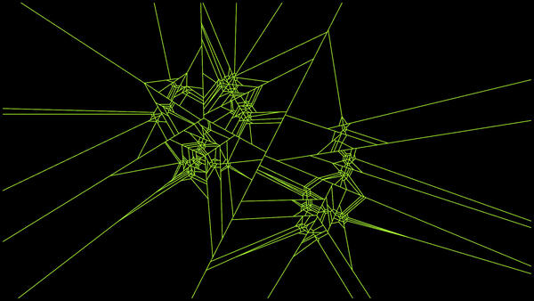

# Raycasting Circle Tree Artwork
Creates a generative artwork based on a random tree where each node can have `(2..n)` children. Starting from the root, line segments are recursively created that partition the space so that `n` circles could be drawn inside the parent circle. These line segments are then used to cast a ray and find the first intersection point with previously added segments, to create the final look.

### Run
To try it out, clone the repo and run:

```$ cargo run --release```

(assuming Rust is installed)
